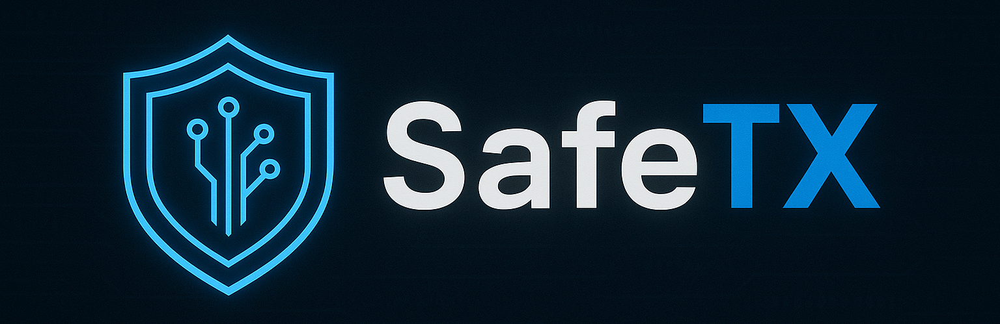

A smart and secure Web3 transaction analysis platform using Artificial Intelligence. Built to protect your crypto wallet and alert you of suspicious or high-risk activities in real time.

## 🚀 Features

- 🔍 **AI-Powered Transaction Risk Classification**
- 📊 **Transaction History with Filtering & Pagination**
- 🔔 **Real-Time Alerts via Webhook and Email**
- 🧠 **Machine Learning with Balanced Training**
- 💻 **Modern Web Interface (React + TailwindCSS)**
- 🛡️ **Secure FastAPI Backend with JWT Auth**
- 📁 **Modular and Scalable Project Architecture**

---

## 🛠️ Tech Stack

| Layer        | Technology                    |
|--------------|-------------------------------|
| Frontend     | React, TypeScript, TailwindCSS|
| Backend      | FastAPI, SQLAlchemy, Uvicorn  |
| AI Engine    | scikit-learn, SMOTE, joblib   |
| Database     | SQLite                        |
| Alerts       | SMTP (Gmail), Webhooks        |

---

## 📦 Installation

### 1. Clone the project
```bash
git clone https://github.com/cshillrj46/SafeTX-AI.git
cd SafeTX-AI
```

### 2. Backend Setup
```bash
cd backend
python -m venv .venv
.venv\Scripts\activate    # Windows
# source .venv/bin/activate   # Linux/Mac
pip install -r requirements.txt
uvicorn main:app --reload
```

### 3. Frontend Setup
```bash
cd ../frontend
npm install
npm start
```

---

## 📈 Usage

- Visit `http://localhost:3000` to access the frontend
- Backend runs at `http://localhost:8000`
- You can submit transactions manually or connect a Web3 wallet integration
- Reclassification and alerts are automatically logged

---

## 🧪 Testing AI Model
To retrain the model:
```bash
python backend/train_model.py
```

Model files are saved in `backend/`:
- `risk_model.joblib`
- `encoder_sender.joblib`
- `encoder_recipient.joblib`
- `encoder_risk.joblib`

---

## 🧩 Folder Structure
```
SafeTX-AI/
├── backend/
│   ├── main.py
│   ├── train_model.py
│   ├── database.py
│   ├── ai_model.py
│   └── ...
├── frontend/
│   ├── src/
│   ├── public/
│   └── ...
├── assets/
│   └── banner.png
├── transactions.csv
├── README.md
└── LICENSE
```

---

## 🤝 Contributing

1. Fork the repository
2. Create your feature branch (`git checkout -b feature/awesome-feature`)
3. Commit your changes (`git commit -m 'Add awesome feature'`)
4. Push to the branch (`git push origin feature/awesome-feature`)
5. Open a Pull Request

---

## 📜 License

This project is licensed under the MIT License. See the [LICENSE](LICENSE) file for details.

---

## 💬 Contact

- Twitter: [@SafeTX_AI](https://twitter.com/SafeTX_AI)
- GitHub Issues: [Report a Bug](https://github.com/cshillrj46/SafeTX-AI/issues)

---

> SafeTX-AI: Empowering secure crypto transactions with smart technology.
